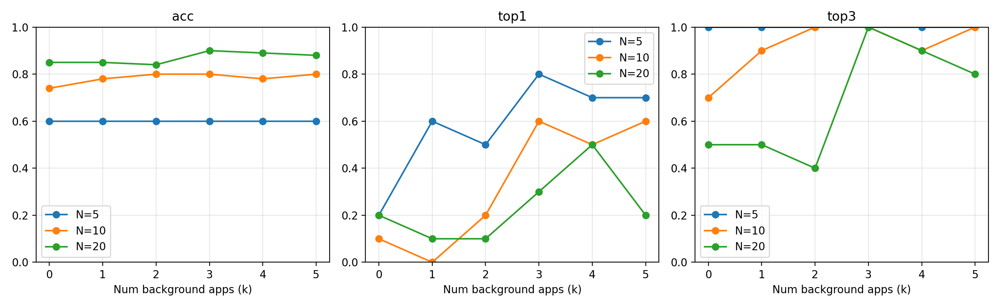

# Attacker-centric victim identification report
## Experiment description
We train the existing per-window Wi‑Fi traffic classifier (feature extraction unchanged) using **pure** windows from each `data/*.json` class. We then evaluate an attacker that ranks users by their **Bitcoin likelihood** (`p(bitcoinsta)`), under simulated N-user mixed-traffic Wi‑Fi scenarios.
In each scenario, there are N users. A subset runs Bitcoin (`bitcoinsta`) mixed with `k` concurrent non-Bitcoin application types (MixingLevel). Others run only non-Bitcoin apps.
## Parameters
| Parameter | Value |
|---|---|
| `N_values` | `[5, 10, 20]` |
| `mixing_levels` | `[0, 1, 2, 3, 4, 5]` |
| `num_runs` | `10` |
| `seed_start` | `0` |
| `bitcoin_users_per_scenario` | `1` |
| `window_duration_s` | `0.2` |
| `user_agg_num_blocks` | `10` |
| `decision_rule` | `top-m users per scenario (m=round(alpha*N)), alpha calibrated per-(N,k) on train-only scenarios` |

## Metrics summary (mean±std over runs)

### N = 5
| k | f1 | pr_auc | top1 | top3 | roc_auc | precision | recall | fp_per_scenario | fp_per_user |
|---|---|---|---|---|---|---|---|---|---|
| 0 | 0.5000±0.0000 | 0.5500±0.2363 | 0.2000±0.4000 | 1.0000±0.0000 | 0.7250±0.1750 | 0.3333±0.0000 | 1.0000±0.0000 | 2.0000±0.0000 | 0.5000±0.0000 |
| 1 | 0.5000±0.0000 | 0.7833±0.2693 | 0.6000±0.4899 | 1.0000±0.0000 | 0.8750±0.1677 | 0.3333±0.0000 | 1.0000±0.0000 | 2.0000±0.0000 | 0.5000±0.0000 |
| 2 | 0.5000±0.0000 | 0.7500±0.2500 | 0.5000±0.5000 | 1.0000±0.0000 | 0.8750±0.1250 | 0.3333±0.0000 | 1.0000±0.0000 | 2.0000±0.0000 | 0.5000±0.0000 |
| 3 | 0.5000±0.0000 | 0.8833±0.2363 | 0.8000±0.4000 | 1.0000±0.0000 | 0.9250±0.1601 | 0.3333±0.0000 | 1.0000±0.0000 | 2.0000±0.0000 | 0.5000±0.0000 |
| 4 | 0.5000±0.0000 | 0.8500±0.2291 | 0.7000±0.4583 | 1.0000±0.0000 | 0.9250±0.1146 | 0.3333±0.0000 | 1.0000±0.0000 | 2.0000±0.0000 | 0.5000±0.0000 |
| 5 | 0.5000±0.0000 | 0.8333±0.2582 | 0.7000±0.4583 | 1.0000±0.0000 | 0.9000±0.1658 | 0.3333±0.0000 | 1.0000±0.0000 | 2.0000±0.0000 | 0.5000±0.0000 |

### N = 10
| k | f1 | pr_auc | top1 | top3 | roc_auc | precision | recall | fp_per_scenario | fp_per_user |
|---|---|---|---|---|---|---|---|---|---|
| 0 | 0.3500±0.2291 | 0.4417±0.2142 | 0.1000±0.3000 | 0.7000±0.4583 | 0.8111±0.1117 | 0.2333±0.1528 | 0.7000±0.4583 | 2.3000±0.4583 | 0.2556±0.0509 |
| 1 | 0.4500±0.1500 | 0.4200±0.1046 | 0.0000±0.0000 | 0.9000±0.3000 | 0.8222±0.1018 | 0.3000±0.1000 | 0.9000±0.3000 | 2.1000±0.3000 | 0.2333±0.0333 |
| 2 | 0.5000±0.0000 | 0.5167±0.2522 | 0.2000±0.4000 | 1.0000±0.0000 | 0.8556±0.0868 | 0.3333±0.0000 | 1.0000±0.0000 | 2.0000±0.0000 | 0.2222±0.0000 |
| 3 | 0.5000±0.0000 | 0.7667±0.2906 | 0.6000±0.4899 | 1.0000±0.0000 | 0.9333±0.0889 | 0.3333±0.0000 | 1.0000±0.0000 | 2.0000±0.0000 | 0.2222±0.0000 |
| 4 | 0.4500±0.1500 | 0.6917±0.3163 | 0.5000±0.5000 | 0.9000±0.3000 | 0.9000±0.1160 | 0.3000±0.1000 | 0.9000±0.3000 | 2.1000±0.3000 | 0.2333±0.0333 |
| 5 | 0.5000±0.0000 | 0.7833±0.2693 | 0.6000±0.4899 | 1.0000±0.0000 | 0.9444±0.0745 | 0.3333±0.0000 | 1.0000±0.0000 | 2.0000±0.0000 | 0.2222±0.0000 |

### N = 20
| k | f1 | pr_auc | top1 | top3 | roc_auc | precision | recall | fp_per_scenario | fp_per_user |
|---|---|---|---|---|---|---|---|---|---|
| 0 | 0.2500±0.2500 | 0.4121±0.3118 | 0.2000±0.4000 | 0.5000±0.5000 | 0.8474±0.1277 | 0.1667±0.1667 | 0.5000±0.5000 | 2.5000±0.5000 | 0.1316±0.0263 |
| 1 | 0.2500±0.2500 | 0.3486±0.2537 | 0.1000±0.3000 | 0.5000±0.5000 | 0.8316±0.1124 | 0.1667±0.1667 | 0.5000±0.5000 | 2.5000±0.5000 | 0.1316±0.0263 |
| 2 | 0.2000±0.2449 | 0.3733±0.2340 | 0.1000±0.3000 | 0.4000±0.4899 | 0.8737±0.0674 | 0.1333±0.1633 | 0.4000±0.4899 | 2.6000±0.4899 | 0.1368±0.0258 |
| 3 | 0.5000±0.0000 | 0.6000±0.2708 | 0.3000±0.4583 | 1.0000±0.0000 | 0.9474±0.0408 | 0.3333±0.0000 | 1.0000±0.0000 | 2.0000±0.0000 | 0.1053±0.0000 |
| 4 | 0.4500±0.1500 | 0.6750±0.3301 | 0.5000±0.5000 | 0.9000±0.3000 | 0.9474±0.0577 | 0.3000±0.1000 | 0.9000±0.3000 | 2.1000±0.3000 | 0.1105±0.0158 |
| 5 | 0.4000±0.2000 | 0.4833±0.2708 | 0.2000±0.4000 | 0.8000±0.4000 | 0.9158±0.0537 | 0.2667±0.1333 | 0.8000±0.4000 | 2.2000±0.4000 | 0.1158±0.0211 |

## Figures

